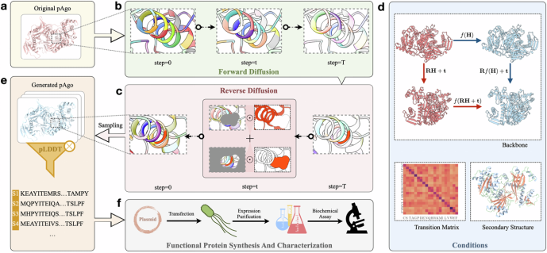

# A conditional protein diffusion model generates artificial programmable endonuclease sequences with enhanced activity

## 🚀 Introduction

The approach achieved over a 10-fold increase in DNA cleavage activity in two complex multi-domain functional proteins (Kurthia massiliensis Ago and Pyrococcus furiosus Ago, referred to as KmAgo and PfAgo), significantly surpassing any existing wild-type protein activity at ambient temperature.



## 🤖 Inference with Ago protein

### prepare dataset

```shell
mkdir -p dataset/Ago
cd dataset
wget wget https://huggingface.co/datasets/tyang816/cath/resolve/main/SS.zip
unzip SS.zip
cd Ago
wget https://huggingface.co/datasets/tyang816/Ago_database_PDB/resolve/main/Ago_AlphaFold2_PDB.zip
unzip Ago_AlphaFold2_PDB.zip
```

#### build pdb graph
```shell
# see `script/gen_graph.sh`
export protein=Ago
python protein_DIFF/dataset/generate_graph.py \
    --pdb_dir dataset/$protein/pdb/ \
    --save_dir dataset/$protein/process/
```

#### fix position (Active/Conservative Sites..)

put `Ago.fix.txt` into `dataset/Ago`

### prepare cath dataset

#### get cath

```shell
# cath
mkdir -p cath40_k10_imem_add2ndstrc/raw
cd cath40_k10_imem_add2ndstrc/raw
wget https://huggingface.co/datasets/tyang816/cath/resolve/main/dompdb.tar
tar -xvf dompdb.tar
rm dompdb.tar
```

#### build data graph

```shell
cd <your/diffusion>
python protein_DIFF/dataset/cath_imem_2nd.py
```

## Start Pre-training

We suggest that you do not change the parameters.

```shell
protein=Ago

CUDA_VISIBLE_DEVICES=0 python protein_DIFF/run_pt.py \
    --batch_size 32 \
    --lr 5e-4 \
    --timesteps 500 \
    --hidden_dim 256 \
    --objective pred_x0 \
    --smooth_temperature 1.0 \
    --wd 0 \
    --clip_grad_norm 1e3 \
    --device_id 0 \
    --depth 6 \
    --drop_out 0.08 \
    --embedding_dim 256 \
    --embedding \
    --norm_feat \
    --Date 1121 \
    --noise_type uniform \
    --target_protein_dir dataset/$protein/process/ \
    --output_dir result/$protein
```

## 🔬 Design Your Own Protein

### Inference

`STEP`: select the model, the higher the value of step, the higher the rr

```shell
mkdir ckpt & cd ckpt
wget https://huggingface.co/tyang816/CPDiffusion/resolve/main/Jun_5_ago_dataset%3DCATH_result_lr%3D0.0005_wd%3D0.0_dp%3D0.08_hidden%3D256_noisy_type%3Duniform_embed_ss%3DFalse_88935.pt
cd ..

STEP=88935
CUDA_VISIBLE_DEVICES=0 python protein_DIFF/inference.py \
    --ckpt ckpt/Jun_5_ago_dataset=CATH_result_lr=0.0005_wd=0.0_dp=0.08_hidden=256_noisy_type=uniform_embed_ss=False_"$STEP".pt \
    --target_protein dataset/Ago/process/AGO_050_model_3_ptm.pt \
    --target_protein_dir dataset/Ago/process/ \
    --gen_num 100 \
    --output_dir result/predict
```

## 🙌 Citation

Please cite our work if you have used our code or data for **dry experiment testing/wet experiment**. We are pleased to see improvements in the subsequent work.

```
@article{zhou2024cpdiffusion_ago,
  title={A conditional protein diffusion model generates artificial programmable endonuclease sequences with enhanced activity},
  author={Zhou, Bingxin and Zheng, Lirong and Wu, Banghao and Yi, Kai and Zhong, Bozitao and Tan, Yang and Liu, Qian and Li{\`o}, Pietro and Hong, Liang},
  journal={Cell Discovery},
  volume={10},
  number={1},
  pages={95},
  year={2024},
  publisher={Springer Nature Singapore Singapore}
}
```